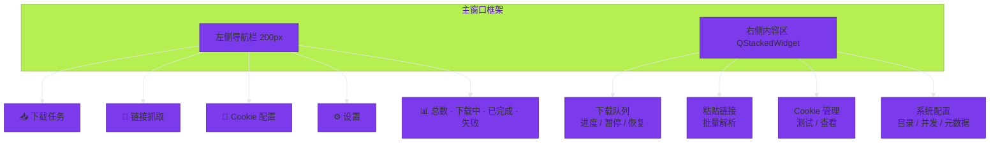
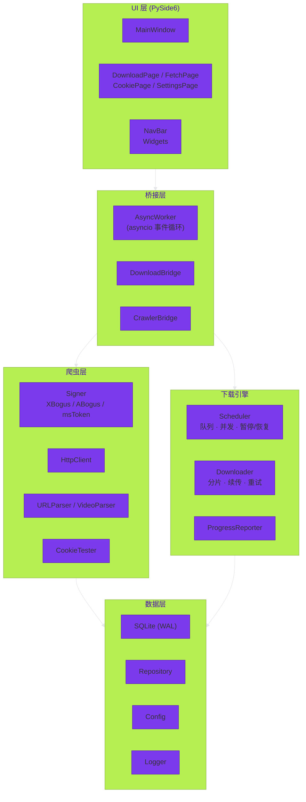

<div align="center">
  

  # 撷风拾影

  <p align="center">
    <strong>「撷取风中流转的光影」</strong>
  </p>

  <p align="center">
    <em>轻量优雅的抖音数据抓取桌面工具</em>
  </p>

  <p align="center">
    <a href="https://github.com/Cat-Drink/Douyin_Catcher/releases">
      
    </a>
    
    
    <a href="LICENSE">
      
    </a>
    
  </p>

  <p align="center">
    
    
    
  </p>

  <br>

  <!-- 导航标签 -->
  <p align="center">
    <a href="#✨-功能特性"><b>功能特性</b></a> ·
    <a href="#📸-界面预览"><b>界面预览</b></a> ·
    <a href="#🚀-快速上手"><b>快速上手</b></a> ·
    <a href="#🛠️-开发指南"><b>开发指南</b></a> ·
    <a href="#🧰-技术栈"><b>技术栈</b></a> ·
    <a href="#📁-项目结构"><b>项目结构</b></a> ·
    <a href="#❓-常见问题"><b>常见问题</b></a>
  </p>
</div>

<br>

> **撷风拾影** —— 名字取自"撷取风中流转的光影"，寓意捕捉互联网上转瞬即逝的精彩内容。  
> 一款面向非技术用户的 Windows 桌面端应用，支持抖音短视频、图文、长视频的数据抓取与下载。  
> 核心算法（签名、解析、下载引擎）均为 **自研组件**，参考 [Evil0ctal/Douyin_TikTok_Download_API](https://github.com/Evil0ctal/Douyin_TikTok_Download_API) 的设计思路，但 **不直接复用其代码**，有效降低外部依赖风险。

---

<br>

## ✨ 功能特性

<div align="center">

| | | |
|:---:|:---:|:---:|
| 📹 **内容全覆盖** | ⚡ **智能下载引擎** | 🎨 **舒适体验** |
| 短视频 · 图文 · 长视频<br>单链接 · 批量 · 主页抓取 | 断点续传 · 并发下载<br>分块加速 · 自动重试 | 现代 PySide6 界面<br>实时进度 · 元数据导出 |

</div>

<br>

<details open>
<summary><strong>📹 内容全覆盖</strong> — 支持多种抖音内容类型与抓取方式</summary>

<br>

| 能力 | 说明 |
|:---|:---|
| 🎬 **短视频下载** | 支持单条抖音短视频下载，保留原始画质 |
| 🖼️ **图文下载** | 支持抖音图文作品的图片与描述一并保存 |
| 🎥 **长视频下载** | 支持超过 30 分钟的长视频资源下载 |
| 🔗 **批量链接** | 粘贴多条链接，批量解析并下载 |
| 👤 **用户主页** | 输入用户主页链接，批量抓取该用户所有作品 |

</details>

<br>

<details open>
<summary><strong>⚡ 智能下载引擎</strong> — 可靠、高效、省心</summary>

<br>

| 能力 | 说明 |
|:---|:---|
| 🔄 **断点续传** | 意外中断后自动恢复，已下载部分不重复，节省时间与流量 |
| 📡 **并发下载** | 可调节并发数（1–10），根据网络情况自由控制带宽占用 |
| 🧩 **分块下载** | 大文件自动切分为多个分片并行下载，显著提升速度 |
| 🔁 **失败重试** | 下载失败自动重试（最多 3 次），临时网络波动无影响 |

</details>

<br>

<details open>
<summary><strong>🎨 舒适用户体验</strong> — 让工具回归工具的本质</summary>

<br>

| 能力 | 说明 |
|:---|:---|
| 🖥️ **现代 UI 界面** | 基于 PySide6 构建，简洁直观、操作流畅 |
| 📊 **实时进度反馈** | 下载进度、速度、状态一目了然，心中有数 |
| 📝 **元数据导出** | 支持 **JSON** / **CSV** 格式导出作品元数据 |
| 🧭 **首次引导** | 首次启动引导配置 Cookie 与下载目录，零门槛上手 |
| 🎯 **侧边栏状态栏** | 底部固定显示下载统计（总数 / 下载中 / 已完成 / 失败） |

</details>

<br>

---

<br>

## 📸 界面预览

> <em>界面截图正在路上，以下为布局预览 — 实际界面以最新 Release 为准。</em>

<br>



<br>

| 页面 | 功能 | 入口 |
|:---|:---|:---:|
| 📥 **下载任务** | 查看下载队列，查看进度、暂停、恢复、重试 | 导航栏第 1 项 |
| 🔗 **链接抓取** | 粘贴抖音链接，批量解析作品信息并加入下载 | 导航栏第 2 项 |
| 🍪 **Cookie 配置** | 添加 / 测试 / 管理 Cookie，查看详细教程 | 导航栏第 3 项 |
| ⚙️ **设置** | 下载目录、并发数、分块大小、元数据格式 | 导航栏第 4 项 |

<br>

---

<br>

## 🚀 快速上手

### 📦 下载安装

从 [GitHub Releases](https://github.com/Cat-Drink/Douyin_Catcher/releases) 页面下载最新版安装包：

```text
XieFengShiYing_Setup_v0.2.2.exe
```

运行安装包，按向导提示完成安装即可。

### 🍪 配置 Cookie

抖音需要登录态才能访问数据，首次启动时引导页会引导你完成配置。你也可以随时在 **Cookie 配置页** 操作：

<details>
<summary><strong>📋 点击查看 Cookie 获取步骤</strong></summary>

<br>

| 步骤 | 操作 |
|:---:|:---|
| **1** | 浏览器打开 [douyin.com](https://www.douyin.com) 并登录你的账号 |
| **2** | 按 <kbd>F12</kbd> 打开开发者工具，切换到 **Network**（网络）标签 |
| **3** | 刷新页面，点击任意网络请求 |
| **4** | 在请求的 **Request Headers** 中找到 `Cookie:` 字段，右键复制完整值 |
| **5** | 回到应用，在 **Cookie 配置页** 粘贴并点击「添加并测试」 |

</details>

<br>

---

<br>

## 🛠️ 开发指南

### 📋 环境要求

| 项目 | 要求 |
|:---|:---|
| 🐍 **Python** | 3.11 或更高版本 |
| 🪟 **操作系统** | Windows 10 / 11（x64） |
| 📦 **包管理器** | pip |

### 🔧 本地开发

```powershell
# 1. 克隆仓库
git clone https://github.com/Cat-Drink/Douyin_Catcher.git
cd Douyin_Catcher

# 2. 创建并激活虚拟环境
python -m venv .venv
.\.venv\Scripts\Activate.ps1

# 3. 安装开发依赖
pip install -r requirements-dev.txt

# 4. 运行测试
pytest

# 5. 代码规范检查
ruff check .
black --check .
```

### 📦 打包构建

```powershell
# PyInstaller 打包（生成 dist/XieFengShiYing/ 目录）
pyinstaller XieFengShiYing.spec --noconfirm

# 生成安装包（需安装 Inno Setup 6）
"%ProgramFiles(x86)%\Inno Setup 6\ISCC.exe" installer.iss
```

### ✅ 代码质量

| 工具 | 用途 | 配置 |
|:---|:---|:---|
| [Ruff](https://github.com/astral-sh/ruff) | 代码检查（pycodestyle + pyflakes + isort + pyupgrade + bugbear） | `pyproject.toml` |
| [Black](https://github.com/psf/black) | 代码格式化 | `pyproject.toml`（行宽 100） |
| [Mypy](https://github.com/python/mypy) | 静态类型检查 | `pyproject.toml` |
| [Pytest](https://github.com/pytest-dev/pytest) | 单元测试 + 集成测试 | `pyproject.toml`（覆盖率 ≥ 80%） |

<br>

---

<br>

## 🧰 技术栈

<div align="center">

| 层级 | 技术 | 版本 | 用途 |
|:---|:---|:---:|:---|
| 🖥️ **UI 框架** | PySide6 (Qt) | 6.x | 图形用户界面 |
| 🕷️ **爬虫引擎** | Python + httpx[http2] | ≥ 3.11 | 异步数据抓取与签名 |
| 🗄️ **数据存储** | SQLite（WAL 模式） | — | 任务 / Cookie / 配置持久化 |
| 📦 **打包分发** | PyInstaller + Inno Setup | — | 构建 Windows 安装包 |
| 🎨 **代码质量** | Ruff + Black + Mypy | — | 静态检查与格式化 |
| 🧪 **测试框架** | Pytest + Coverage | — | 单元测试与覆盖率 |

</div>

<br>

### 🏗️ 架构分层



<br>

---

<br>

## 📁 项目结构

```text
📦 XieFengShiYing/
├── 📂 app/                  # 数据层
│   ├── 📄 config.py         # 全局常量、路径、默认配置
│   ├── 📄 database.py       # 数据库初始化与迁移
│   ├── 📄 logger.py         # 日志配置
│   ├── 📄 models.py         # 数据模型（Task, Cookie 等）
│   └── 📂 repositories/     # 数据访问层
│
├── 📂 ui/                   # PySide6 界面
│   ├── 📄 main_window.py    # 主窗口框架
│   ├── 📂 pages/            # 功能页面
│   │   ├── 📄 download_page.py
│   │   ├── 📄 fetch_page.py
│   │   ├── 📄 cookie_page.py
│   │   ├── 📄 settings_page.py
│   │   └── 📄 onboarding_page.py
│   ├── 📂 widgets/          # 可复用组件
│   │   ├── 📄 nav_bar.py
│   │   └── 📄 toast.py
│   └── 📂 assets/           # 样式表与资源
│
├── 📂 crawlers/             # 爬虫组件
│   ├── 📂 signer/           # 签名算法
│   │   ├── 📄 xbogus.py
│   │   ├── 📄 abogus.py
│   │   ├── 📄 mstoken.py
│   │   └── 📄 verify_fp.py
│   ├── 📄 http_client.py    # HTTP 客户端
│   ├── 📄 url_parser.py     # 链接解析
│   ├── 📄 video_parser.py   # 视频信息解析
│   └── 📄 cookie_tester.py  # Cookie 有效性测试
│
├── 📂 downloader/           # 下载引擎
│   ├── 📄 scheduler.py      # 任务调度与并发控制
│   ├── 📄 downloader.py     # 核心下载逻辑
│   ├── 📄 progress_reporter.py
│   └── 📄 constants.py      # 常量定义
│
├── 📂 worker/               # 线程桥接
│   ├── 📄 async_worker.py   # asyncio 事件循环线程
│   ├── 📄 download_bridge.py
│   ├── 📄 crawler_bridge.py
│   └── 📄 signals.py        # Qt 信号定义
│
├── 📂 assets/               # 应用图标
├── 📂 tests/                # 测试套件
├── 📂 docs/                 # 设计文档与计划
│
├── 📄 pyproject.toml        # 项目配置与构建工具
├── 📄 XieFengShiYing.spec   # PyInstaller 打包配置
├── 📄 installer.iss         # Inno Setup 安装脚本
├── 📄 LICENSE               # MIT 许可证
└── 📄 README.md             # 项目说明（就是这个文件）
```

<br>

---

<br>

## ❓ 常见问题

<details>
<summary><strong>为什么需要配置 Cookie？</strong></summary>

<br>

抖音大部分数据接口需要登录态才能访问。Cookie 中包含了你的登录凭证，应用需要用它来请求视频数据。Cookie 仅在你本机使用，**不会上传到任何第三方服务器**。

</details>

<br>

<details>
<summary><strong>下载的视频保存在哪里？</strong></summary>

<br>

默认保存在 `%USERPROFILE%/Downloads/XieFengShiYing/` 目录下。你可以在 **设置页** 中随时更改。

</details>

<br>

<details>
<summary><strong>下载中断了怎么办？</strong></summary>

<br>

不用担心！应用支持 **断点续传**。重新启动应用后，未完成的任务会自动进入下载队列，从断点处继续下载，已下载的部分不会重复。

</details>

<br>

<details>
<summary><strong>如何获取帮助或报告问题？</strong></summary>

<br>

欢迎在 [GitHub Issues](https://github.com/Cat-Drink/Douyin_Catcher/issues) 提交问题或建议。提问前请先搜索是否已有类似问题。

</details>

<br>

---

<br>

## 📄 许可证

<div align="center">

本项目基于 **MIT 许可证** 开源。

<br>

[查看 LICENSE 文件](LICENSE) ·
[GitHub 仓库](https://github.com/Cat-Drink/Douyin_Catcher) ·
[提交 Issue](https://github.com/Cat-Drink/Douyin_Catcher/issues)

<br>

<sub>
  Copyright © 2026 撷风拾影 Contributors ·
  <a href="https://github.com/Cat-Drink/Douyin_Catcher/graphs/contributors">贡献者</a>
</sub>

</div>

<br>

---

<br>

<div align="center">
  <br>
  <sub>
    <strong>撷风拾影</strong> — 用 ❤️ 构建 ·
    <em>撷取风中流转的光影，珍藏每一刻精彩</em>
  </sub>
  <br><br>
  <sub>
    <code>⭐ 如果这个项目对你有帮助，欢迎 Star 支持！</code>
  </sub>
  <br><br>
  <sub>
    <a href="#撷风拾影">⬆️ 回到顶部</a>
  </sub>
</div>
